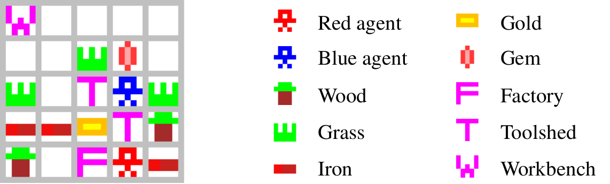
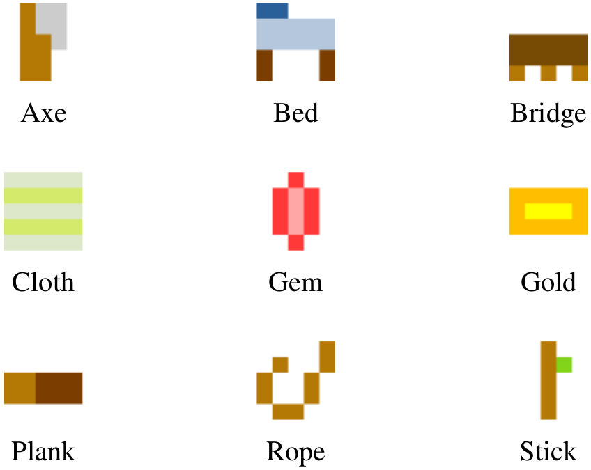

# Multi-Agent Intention Progression with Reward Machines

Source code for the IJCAI-22 paper *Multi-Agent Intention Progression with Reward Machines*, by Michael Dann, Yuan Yao, Natasha Alechina, Brian Logan and John Thangarajah.

## Running

To launch the experiments, just run the main Java file (/src/main/Main.java). The code is set up to run the Craft World experiments by default, but this can be changed by setting environment = Environment.OFFICE_WORLD near the top of the file. Results are automatically saved to the /log folder. A video for each run is generated automatically, provided ffmpeg is installed.

## Sample Videos

In the [videos](https://github.com/mchldann/IRM_IJCAI/tree/main/videos) folder, we have provided demos of the agents attempting the Office World and Craft World tasks.

For Office World, we have included examples of success and failure for each agent pairing. Note that very occasionally (as in [I_RM_and_RL_tau0_01_failure.mp4](https://github.com/mchldann/IRM_IJCAI/blob/main/videos/office_world/I_RM_and_RL_tau0_01_failure.mp4?raw=true)), the agents are spawned such that it is impossible for the blue agent to avoid a collision.

For Craft World, we have provided a selection of videos corresponding to some of the particularly strong or weak performances in Table 3 of the paper. The below image shows how the agents, the raw materials and the crafting locations are represented:

The current inventories of the agents are indicated to the sides of the screen (blue agent on the left, red agent on the right). The sprites used for the goal items are shown below:

